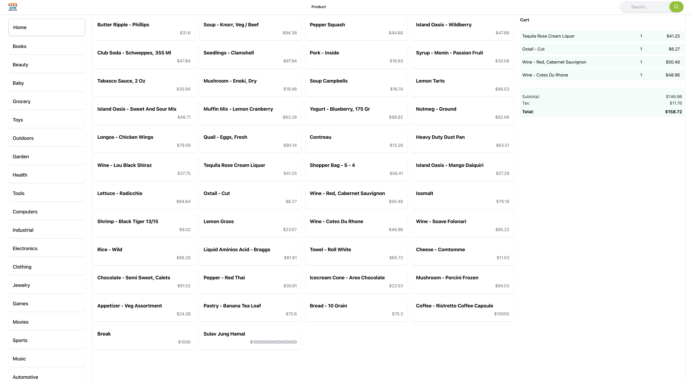

# Register Management System

The Register Management System is a web-based application designed to streamline and digitize the register management processes within an organization. It provides a centralized platform for efficient data entry, search, and retrieval of various types of registers, including attendance logs, visitor records, inventory tracking, and more.

## Key Features

- User-friendly interface for easy navigation and usage.
- Register creation and management functionalities.
- Efficient data entry with validation and error handling.
- Advanced search and filtering options for quick data retrieval.
- Reporting and analytics capabilities for data analysis.
- Role-based access control to ensure data privacy and security.
- Integration with external systems for seamless data exchange.
- Scalable architecture to accommodate future expansion and enhancements.


## Register Management System Tech Stack

The Register Management System is built using a combination of backend and frontend technologies to provide a comprehensive and efficient solution for managing registers within an organization. The tech stack includes:

### Backend

- **Node.js**: A JavaScript runtime that allows running JavaScript code outside the browser. It provides the server-side environment for building web applications.
- **Express**: A fast and minimalist web application framework for Node.js. It simplifies the development of robust and scalable APIs.
- **SQLite**: A lightweight and self-contained database engine. It is used for storing and retrieving register data.

### Frontend

- **React**: A popular JavaScript library for building user interfaces. React allows creating dynamic and interactive frontend components.
- **Tailwind CSS**: A utility-first CSS framework that provides a set of pre-built styles and utility classes. It enables rapid UI development and customization.

### Additional Tools and Libraries

- **npm**: A package manager for Node.js that manages project dependencies and facilitates the installation of required libraries and modules.
- **Webpack**: A module bundler that combines multiple JavaScript modules into a single bundle for efficient loading and execution in the browser.
- **Babel**: A JavaScript compiler that transforms modern JavaScript code into a compatible version for older browsers.
- **Axios**: A popular HTTP client library for making asynchronous requests from the frontend to the backend API.
- **React Router**: A routing library for React that enables client-side navigation and URL routing within the application.

The combination of these technologies provides a powerful and efficient solution for managing registers, offering a seamless user experience and streamlined workflow.

## Getting Started

### Prerequisites

- Node.js (version v18.16.0)
- npm (version 9.5.1)
- Database system (SQLite)

### Installation

1. Clone the repository:

```bash
git clone https://github.com/Sulavjung/registermanagementsystem.git
```

2. Install the dependencies:

```bash
cd registerManagementSystem
npm install
```

3. Start the application:

```bash
npm run develop
```

4. Access the application:
   - Open your web browser and visit `http://localhost:3006` to access the Register Management System.

## Contributing

We welcome contributions to enhance the Register Management System. To contribute, please follow these steps:

1. Fork the repository.
2. Create a new branch for your feature or bug fix.
3. Make your changes and commit them with descriptive commit messages.
4. Push your changes to your forked repository.
5. Submit a pull request, explaining the changes and their purpose.

We appreciate your contributions and will review them as soon as possible. Together, we can make the Register Management System even better!


## Acknowledgements

We would include the name of the people who make significant contribution to this project.

- [Name](https://github.com/username) - Provided guidance and support throughout the development process.
- [Project Name](https://github.com/project-name) - Inspired certain aspects or functionality of the Register Management System.

## Contact

For any inquiries or feedback regarding the Register Management System, please reach out to our team at [contact@sulavhamal.com]. We appreciate your interest and would be happy to assist you.
